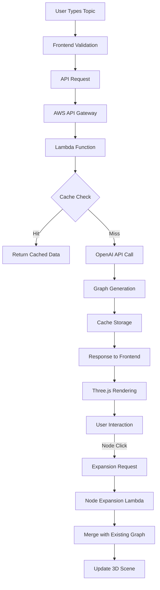

# Synapti System Architecture Design

## 1. High-Level System Architecture

### Architecture Overview

```
┌─────────────────────────────────────────────────────────────────┐
│                        Client Layer                             │
├─────────────────────────────────────────────────────────────────┤
│  Web Browser (React + Vite + Three.js)                         │
│  ┌─────────────────┐ ┌─────────────────┐ ┌─────────────────┐   │
│  │ Input Component │ │ 3D Canvas       │ │ Export Panel    │   │
│  │ - Topic Entry   │ │ - Node Renderer │ │ - JSON/PPTX     │   │
│  │ - Generate Btn  │ │ - Interaction   │ │ - Google Slides │   │
│  └─────────────────┘ └─────────────────┘ └─────────────────┘   │
└─────────────────────────────────────────────────────────────────┘
                               │ HTTPS REST API
                               ▼
┌─────────────────────────────────────────────────────────────────┐
│                      Edge Layer                                 │
├─────────────────────────────────────────────────────────────────┤
│  AWS CloudFront CDN                                             │
│  ┌─────────────────┐ ┌─────────────────┐ ┌─────────────────┐   │
│  │ Static Assets   │ │ API Gateway     │ │ CORS & Security │   │
│  │ Cache           │ │ Rate Limiting   │ │ Headers         │   │
│  └─────────────────┘ └─────────────────┘ └─────────────────┘   │
└─────────────────────────────────────────────────────────────────┘
                               │
                               ▼
┌─────────────────────────────────────────────────────────────────┐
│                    Application Layer                            │
├─────────────────────────────────────────────────────────────────┤
│  AWS Lambda Functions (FastAPI + Mangum)                       │
│  ┌─────────────────┐ ┌─────────────────┐ ┌─────────────────┐   │
│  │ Graph Generator │ │ Node Expander   │ │ Export Service  │   │
│  │ Function        │ │ Function        │ │ Function        │   │
│  └─────────────────┘ └─────────────────┘ └─────────────────┘   │
└─────────────────────────────────────────────────────────────────┘
                               │
                    ┌──────────┼──────────┐
                    ▼          ▼          ▼
┌─────────────────────────────────────────────────────────────────┐
│                    Service Layer                                │
├─────────────────────────────────────────────────────────────────┤
│  ┌─────────────────┐ ┌─────────────────┐ ┌─────────────────┐   │
│  │ OpenAI Service  │ │ Cache Service   │ │ Export Pipeline │   │
│  │ - GPT-4 API     │ │ - ElastiCache   │ │ - PPTX Gen      │   │
│  │ - Structured    │ │ - Redis         │ │ - JSON Export   │   │
│  │   Output        │ │ - TTL Management│ │ - Google API    │   │
│  └─────────────────┘ └─────────────────┘ └─────────────────┘   │
└─────────────────────────────────────────────────────────────────┘
                               │
                               ▼
┌─────────────────────────────────────────────────────────────────┐
│                     Data Layer                                  │
├─────────────────────────────────────────────────────────────────┤
│  ┌─────────────────┐ ┌─────────────────┐ ┌─────────────────┐   │
│  │ DynamoDB        │ │ S3 Storage      │ │ Pinecone Vector │   │
│  │ - Session Data  │ │ - Export Files  │ │ - RAG Knowledge │   │
│  │ - Graph Cache   │ │ - Static Assets │ │ - Embeddings    │   │
│  └─────────────────┘ └─────────────────┘ └─────────┬───────┘   │
│                                                     │           │
│                                          ┌─────────▼───────┐   │
│                                          │ Future Phase 2  │   │
│                                          └─────────────────┘   │
└─────────────────────────────────────────────────────────────────┘
```

### Component Interactions

#### 1. Mindmap Generation Flow
```
User Input → Frontend Validation → API Gateway → Lambda (Graph Generator)
    ↓
OpenAI Structured Output → Graph Processing → Cache Storage → JSON Response
    ↓
Frontend Receives Graph → Three.js Rendering → Interactive 3D Display
```

#### 2. Node Expansion Flow
```
Node Click → Expansion Request → Lambda (Node Expander) → Cache Check
    ↓
Cache Miss → OpenAI Sub-concept Generation → Graph Merge → Cache Update
    ↓
Delta Response → Frontend Graph Update → Three.js Scene Merge
```

#### 3. Export Flow
```
Export Request → Lambda (Export Service) → Format Processing
    ↓
JSON: Direct Download ← Graph Data ← Current State
PPTX: pptxgenjs Processing ← Slide Generation ← Graph Layout
Google Slides: OAuth Flow → API Integration → Slide Creation
```

## 2. Data Flow Architecture

### Real-time Data Flow



### Performance Critical Paths

**Priority 1: Initial Load (<2s)**
- Optimized Lambda cold start
- Efficient OpenAI prompt engineering
- Minimal graph complexity (6-8 nodes)
- Aggressive caching strategy

**Priority 2: Node Expansion (<1s)**
- Session-aware caching
- Incremental graph updates
- WebGL optimization
- Lazy loading patterns

## 3. Technology Stack Integration

### Frontend Stack
```yaml
Framework: React 18 + TypeScript
Build Tool: Vite (HMR, fast builds)
3D Engine: Three.js + React Three Fiber
State Management: Zustand (lightweight)
Styling: Tailwind CSS + Styled Components
Testing: Vitest + React Testing Library
```

### Backend Stack
```yaml
Framework: FastAPI + Pydantic v2
Runtime: Python 3.11 + Mangum (AWS Lambda)
AI Service: OpenAI GPT-4 + Structured Outputs
Caching: Redis (ElastiCache)
Authentication: JWT + AWS Cognito (future)
Monitoring: AWS CloudWatch + X-Ray
```

### Infrastructure Stack
```yaml
Compute: AWS Lambda + API Gateway
Storage: DynamoDB + S3
CDN: CloudFront
Cache: ElastiCache (Redis)
Monitoring: CloudWatch + X-Ray
IaC: AWS CDK (TypeScript)
```

## 4. Security Architecture

### Security Layers
1. **Edge Security**: CloudFront + WAF
2. **API Security**: CORS, Rate limiting, Input validation
3. **Function Security**: Lambda execution roles, VPC isolation
4. **Data Security**: Encryption at rest/transit, API key management

### Key Security Measures
- OpenAI API keys in AWS Secrets Manager
- CORS restricted to approved domains
- Rate limiting per IP/session
- Input sanitization and validation
- No client-side API key exposure

## 5. Scalability Design

### Auto-scaling Patterns
- **Lambda Concurrency**: 1000 concurrent executions (adjustable)
- **API Gateway**: 5000 RPS default limit
- **ElastiCache**: Multi-AZ deployment
- **DynamoDB**: On-demand scaling

### Performance Targets
- **Cold Start**: <500ms (optimized dependencies)
- **Warm Start**: <100ms
- **Cache Hit**: <50ms response time
- **OpenAI API**: <1.5s average response
- **Total SLA**: 95% requests under performance targets